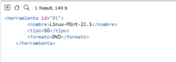

# 
 **Tutotial de XQuery** 

## Borja Torres Tortillol

# 
**¿Que es Xquery?**

## **Xquery** en un lenguaje de consultas en base al lenguaje de datos XML,**Es muy similar a SQL**.
## **Xquery** fue desarollado por el **Equipo de Consulta XML** del **W3C**. 
## El **W3C** es un consorcio internacional que genera un serie de estandares y recomendaciones que aseguran el crecimiento y el crecimiento de la World Wide Web.
## Tambien tomaron participacion el Equipo de Trabajo XSL y el equipo de desarrollo de XSLT.

# 
**Caracteristicas**

## **Lista de Caracteristicas de XQuery**:

* Xquery proporciona los Medios para extraer y manipular datos en **XML**.

* Puede Construir documentos Xml a partir de 0 desde consultas realizadas.

* El lenguaje se basa en un modelo de Arbol de la informacion que contiene.
  
* Los elementos de unas secuencia pueden ser aotmicos o nodos.
  
* Xquery 1.0 no incluye capacidad de actualizar los docuemntos XML.
  
* Tampoco puede realizar búsquedas textuales. 

* Estas dos capacidades están siendo objeto de desarrollo para su posible incorporación en la siguiente versión del lenguaje.

# 
**¿Cómo se crea una consulta con XQuery?**

## Ejemplo de XML de las consultas que voy a hacer:

* A partir de un Documento XML procederemos a hacer una consulta simple:

* Querremos buscar los datos de la Herramienta con ID 01

  * for $nombreconsulta in doc("example") //heramientas/herramienta[@id=01]

  * return $nombreconsulta

* Nos devuelve los datos de la Herramienta con ID 1

# 
**¿Cuales son las expresiones FLWOR de XQuery?**

## **FLWOR** es un Acronimo con sus siguentes siglas:
* **F** de **FOR**:
  * El **FOR** selecciona una secuencia de Modulos.
* **L** de **LET**:
  * El **LET** une una secuencia a una Variable.
* **W** de **WHERE**:
  * El **WHERE** filtra los Nodos.
* **O** de **ORDER BY**:
  * El **ORDER BY** ordena los Nodos.
* **R** de **RETURN**:
  * El **RETURN** da a devolver todos los datos que hemos solicitado.

# 
**¿Cómo podemos utilizar XQuery con HTML?**

* Para utilar HTML con consultas Xquery es muy sencillo 

* Aqui un ejemplo en formato lista:

  * "(ul)"
{
for $nombreconsulta in doc("example") //heramientas return $nombreconsulta
}
"(/ul)"

* Y nos devolveria la consulta en formato lista desordenada.